# majority-judgment-tracker
This repository is a simple tool for tracking the progress of opinion with majority-judgment.
It provides elegant plots such as merit profiles, merit profile evolutions.

The database is a simple .csv file that contains polls compatible with the majority judgment rules:
`presidentielle_jm.csv`

The number of grades depends on the survey (4,5,6). An AggregationMode Enum is provided to choose the aggregation mode.
The mapping to a common system of grades is provided in the `standardisation.csv` file.

The Majority Judgment Tracker provides a tool for monitoring changes in opinions via majority judgment. This system offers refined plots like merit profiles and merit profile evolutions, all stored in a basic .csv database compatible with majority judgment rules.

# Analyse des résultats de l'élection présidentielle 2022

## Contexte
Pendant les campagnes présidentielles, de nombreux sondages sont réalisés pour anticiper les résultats de l'élection et sonder l'opinion des Français. Des outils tels que nsppolls.fr agrègent ces résultats pour fournir des estimations plus fiables des intentions de vote pour le scrutin majoritaire, comme le fait electracker.fr. Toutefois, Mieux Voter promeut l'utilisation du jugement majoritaire, une méthode de scrutin qui reflète davantage l'opinion des électeurs. Pour la première fois, des sondages utilisant cette méthode ont été réalisés durant cette campagne. Ces sondages ont permis d'évaluer l'évolution des opinions grâce à ce mode de scrutin.

Dans cet article, nous présentons les outils développés pour mesurer, visualiser et agréger les résultats de ces sondages au jugement majoritaire. Ces instruments offrent une perspective critique sur le scrutin majoritaire traditionnel.

## Le profil de mérite

Il est une photographie de l’opinion à l’instant du sondage.
Il permet de classer les candidats avec la meilleure mention majoritaire à la moins bonne mention majoritaire.
On présente ci-dessous les profils de mérite des 3 sondages inédits au jugement majoritaire
qui ont consulté des panels représentatifs de Français sur l’élection présidentielle 2022.

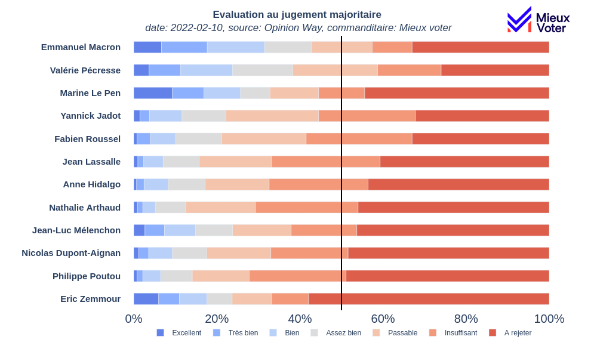
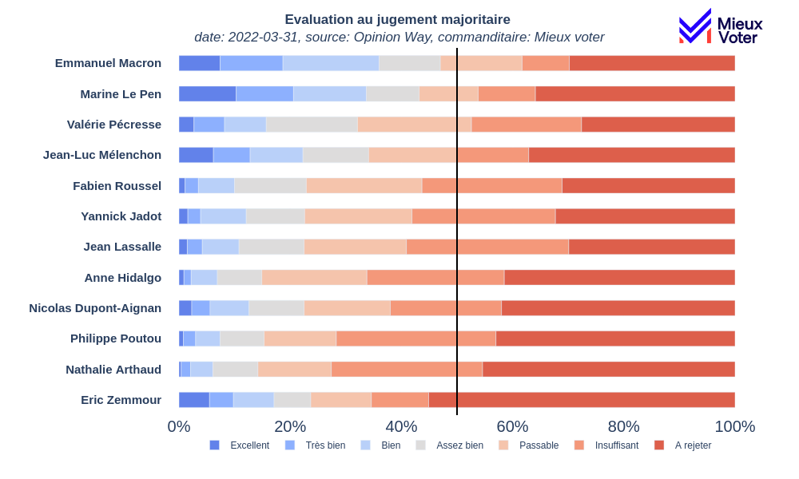

### L'évolution du classement

D'un profil de mérite à l'autre, le classement des candidats change. Pour mettre en lumière cette évolution,
nous avons utilisé un graphique qui permet de visualiser l'évolution du classement des candidats au cours des trois sondages.
Les mentions majoritaires des candidats sont représentées par des aires de couleur.

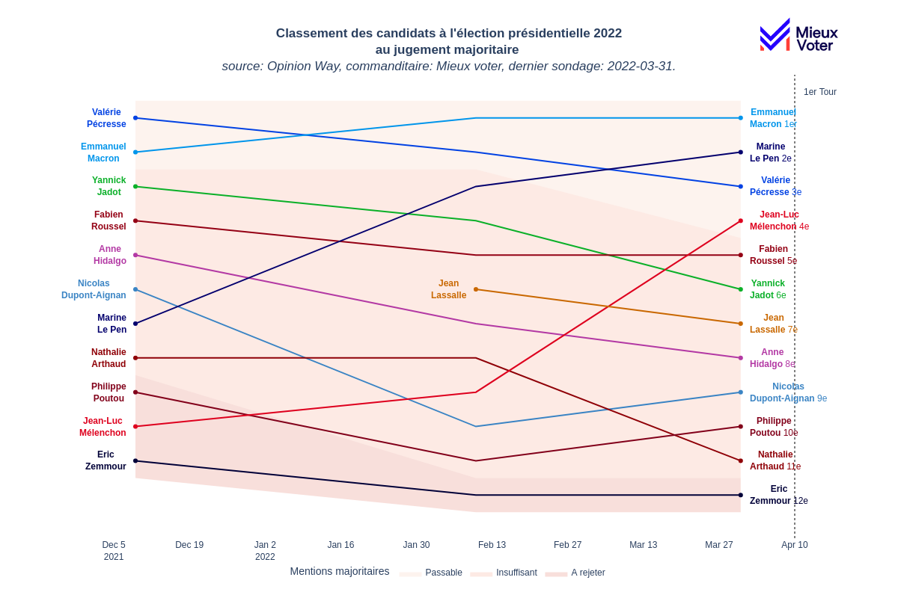

Ce graphique nous permet de constater les ascensions de Marine Le Pen et de Jean-Luc Mélenchon dans le classement.
On constate aussi que Valérie Pécresse a perdu deux places depuis le premier sondage.

### Le profil de mérite temporel

Lorsque le classement change, les proportions des mentions attribuées aux candidats varient d'un sondage à l'autre.
Ce graphique permet de visualiser cette évolution du profil de mérite au cours du temps pour chaque candidat.

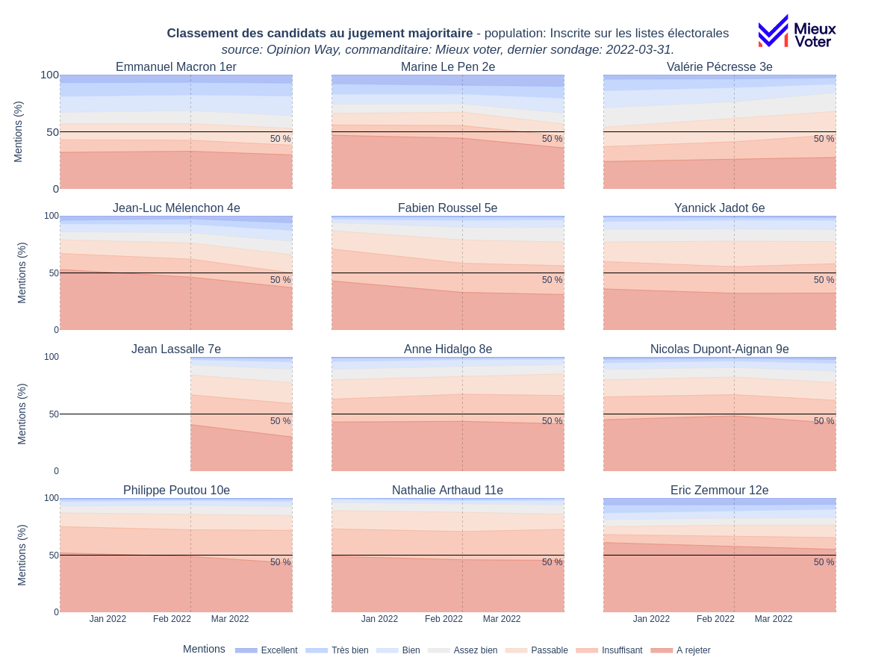

### Evolution des intentions de votes au jugement majoritaire et scrutin majoritaire

#### Emmanuel Macron
Le candidat président dispose à la fois d'intentions de votes importants au scrutin majoritaire, le classant 1er, et d'une base solide,
d'adhésion au jugement majoritaire, le classant 1er aussi depuis notre second sondage.
Les sondages au jugement majoritaire nous permettent de constater
qu'il n'a que peu convaincu durant cette première partie de campagne.

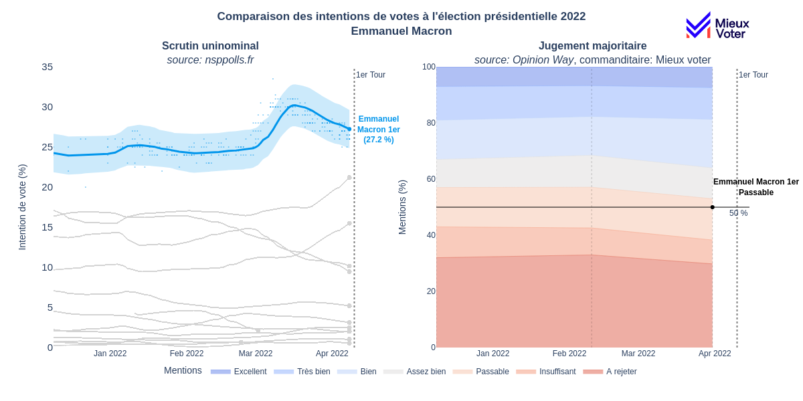

#### Marine Le Pen & Jean-Luc Mélenchon

Le point commun des deux candidats est qu'ils ont effectués une progression forte dans le classement au jugement majoritaire.
Ces progressions témoignent de campagnes qui ont réussi à convaincre.
Marine Le Pen s'est classé 7e, 3e puis 2e. Pour la première fois, son classement final au jugement majoritaire est le même qu'au scrutin majoritaire, confirmant qu'elle a réussi à convaincre.

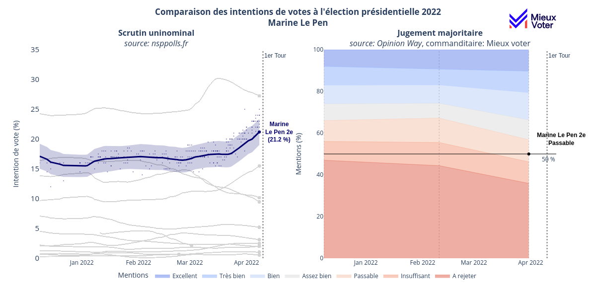

Jean-Luc Mélenchon s'est classé 10e, 8e puis 4e. Son classement final au jugement majoritaire est 4e, et 3e au scrutin majoritaire.
Cette tendance dans les deux modes de scrutin confirme qu'il a réussi à convraincre pendant la campagne.

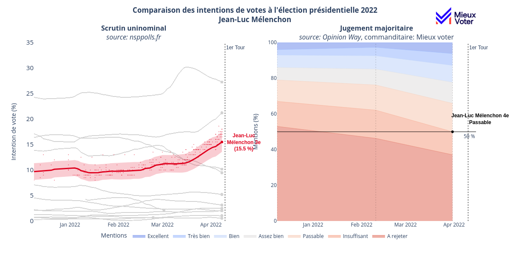

#### Fabien Roussel

Les intentions de votes de Fabien Roussel n'ont jamais dépassé les 5 % au scrutin majoritaire. Pourtant au jugement majoritaire,
il s'est classé 4e, 5e et 5e. D'après les profils de mérite temporels, il a réussi à convaincre, en augmentant son pourcentage
de mentions positives et en diminuant la part de mention négatives. Le jugement majoritaire mesure le fait que
Fabien Roussel est un candidat qui a réussi à séduire les électeurs chose qui n'est pas mesurable avec le scrutin uninominal.

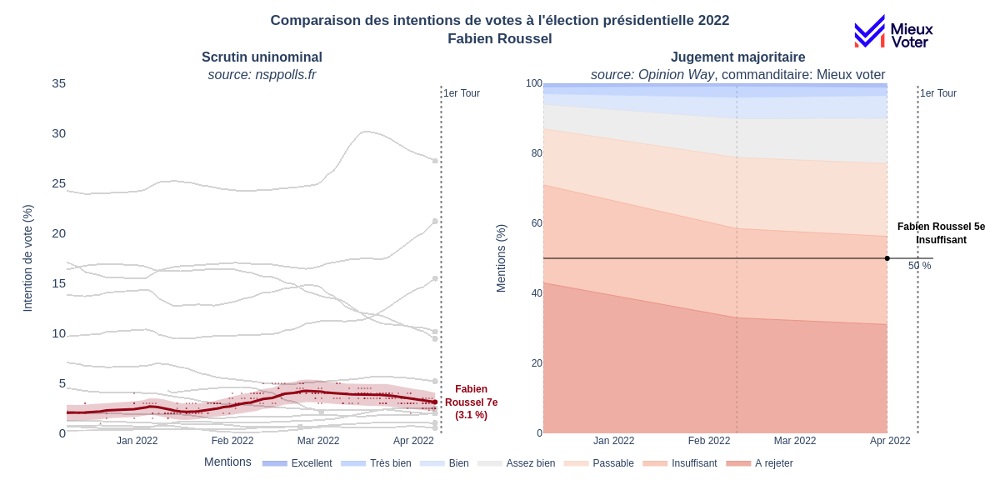

#### Valérie Précresse

Valérie Pécresse est la seule candidate qui a vu ses évaluations fortement baisser. Elle est par
conséquent passée de la 1ère, à la 2nde puis à la 3e position avec le jugement majoritaire.
Le jugement majoritaire nous permet de comprendre les raisons de cette baisse au scrutin majoritaire.
Valérie Pécresse a été dévaluée par les électeurs.

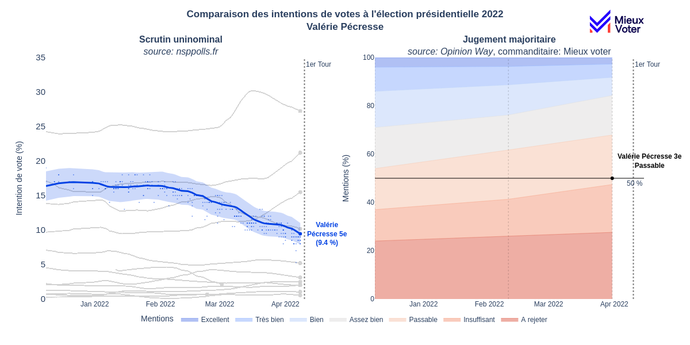

#### Eric Zemmour
Enfin, il est indéniable que le mode scrutin actuel (majoritaire) accorde trop d’attention au candidat Zemmour
qui le sur-valorise (4e). Il est toujours rejeté par plus de 50% des électeurs au jugement majoritaire,
il se classe donc 12e et dernier à chaque sondage.

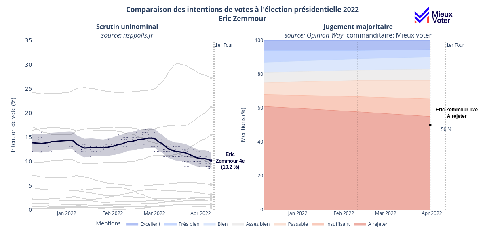

### D'autres sondages compatibles avec le jugement majoritaire

D'autres sondages non-spécifiques de l'élection présidentielle 2022 sont disponibles et compatibles avec le jugement majoritaire.
En effet, trois sondages ne permettent pas de capturer les évolutions du profil de mérite des candidats dans le détails.
Pour aller plus loin, il nous faut plus de données. Pour cela on traitera au jugement majoritaire les données issues
du baromètre politique ELABE et du tableau de bord des personnalités IFOP.

Dans ces enquêtes, la possibilité de ne pas s'exprimer est offertes aux personnes sondées.
On a retiré les personnes sans opinion de chacune des enquêtes, en faisant l’hypothèse que la
distribution des « sans opinion » sera la même que les personnes déterminées.
Nous avons néanmoins décidé de conserver cette information pour l'exposer dans les graphiques qui suivent.

#### ELABE - Baromètre politique

Cette enquête attribue 4 mentions par candidats : positive, plutôt positive, plutôt négative, négative.
Voyons le classement des candidats au jugement majoritaire, depuis le mois de juin 2021.
Tous les candidats ne sont pas inclus dans cette étude.

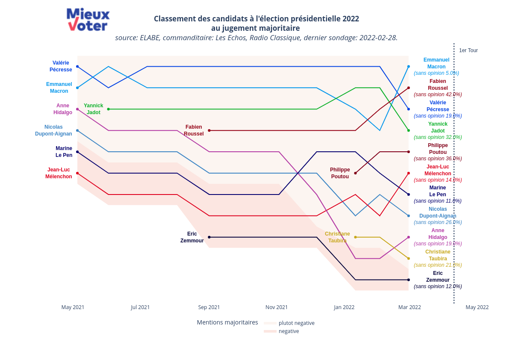

On retrouve un groupe de tête similaire dans ce classement avec Emmanuel Macron, Valérie Pécresse,
Yannick Jadot et Fabien Roussel. Il capture aussi l'ascension de Marine Le Pen mais pas celle de Jean-Luc Mélenchon.
Sur les profils de mérite temporels, on a représenté l'aire des sondés indécis autour de la médiane pour exprimer une incertitude sur la mention majoritaire.

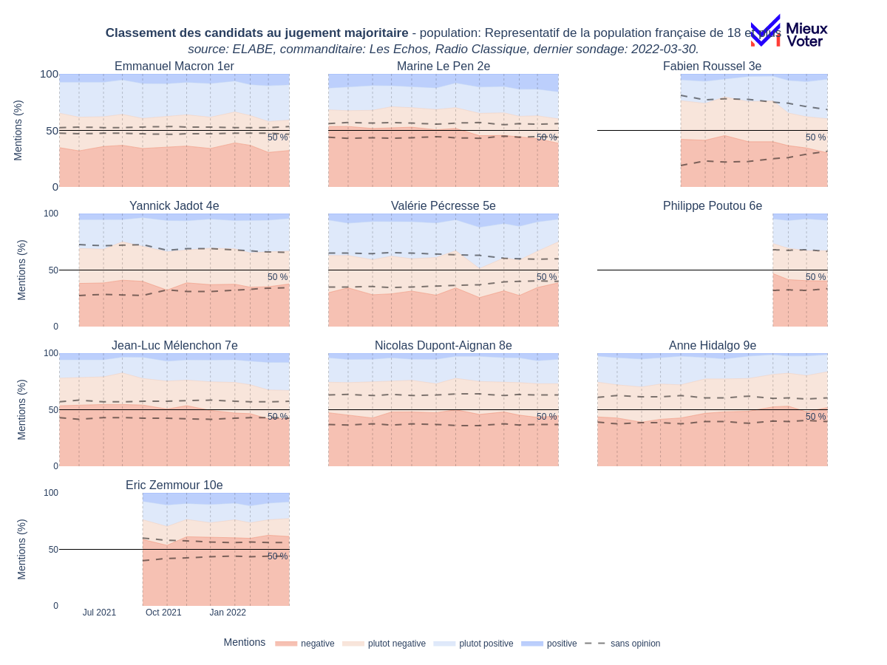

Ce sondage confirme l'augmentation de l'adhésion aux idées de la candidate Marine Le Pen. Elle était en progrès depuis Novembre.
Fabien Roussel a constament réduit le pourcentage de personnes indécises à son égard et il a renforcé sa base d'ashésion.
Cela confirme qu'il a convaincu au cours de la campagne.
Jean-Luc Mélenchon n'a pas assez progressé avec son sondage pour arriver dans le haut du classement.
Plus de 50% des sondés attribuent une mention négative à Eric Zemmour, le classant dernier à chaque sondage.
La plupart des candidats ont convaincu au cours de la campagne, ou n'ont pas renforcé leur rejet.
Grâce à ces sondages, on mesure que Anne Hidalgo et surtout Valérie Pécresse sont les seules candidates à avoir été dévaluées.

#### IFOP - Tableau de bord des personnalités

Cette enquête attribue 4 mentions par candidats : excellente opinion, bonne opinion, mauvaise opinion et très mauvaise opinion.
Voyons le classement des candidats au jugement majoritaire, depuis le mois de décembre 2021.

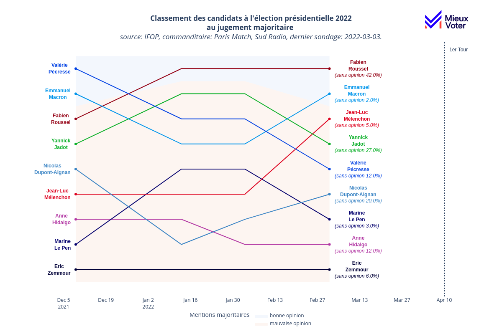

On retrouve un groupe de tête similaire dans ce classement avec Emmanuel Macron, Valérie Pécresse,
Yannick Jadot et Fabien Roussel jusqu'en Février. Il capture ici l'ascension de Jean-Luc Mélenchon mais pas celle de Marine Le Pen.

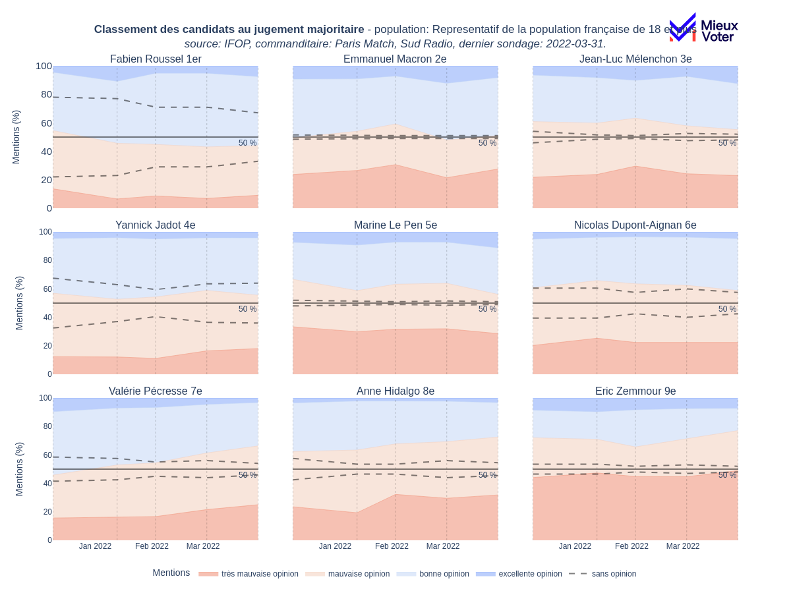

De la même manière que dans le sondage ELABE, Fabien Roussel a constament réduit le pourcentage de personnes indécises à son égard et il a renforcé sa base d'ashésion.
Il confirme qu'il a convaincu au cours de la campagne. Plus de 75% des sondés attribuent une mention négative ou très négative à Eric Zemmour, le classant dernier à chaque sondage.
Jean-Luc Mélencshon a progressé avec son sondage pour arriver dans le haut du classement (3e).
On mesure aussi que Anne Hidalgo et Valérie Pécresse sont les seules candidates à avoir été dévaluées. Cela confirme que le recul des intentions de votes au scrutin majoritaire uninominal
est dû à une dévaluation de la part des electeurs et ne vient pas du report des voix.
En revanche, ce sondage ne mesure pas autant la progression de Marine Le Pen que dans le sondage ELABE et Opinion Way.

Ce sondage mesure moins bien l'opinion au jugement majoritaire que les autres à cause de ses mentions
très tranchées : très mauvaise, mauvaise, bonne, excellente. Le fait qu'il n'y ait pas un entre deux entre mauvaise et bonne opinion
comme "passable ou "assez bien" dans les sondages Opinion Way, ou "plutot positive" ou plutot négative dans les sondages
ELABE change le classement au JM par rapport ces deux autres sondages.

### Vers l'agrégation des sondages au jugement majoritaire

Pour toujours mieux capturer l'évolution de l'opinion, nous avons tenté d'agréger les différents sondages
présentés dans ces articles. Il conviendra de standardiser les mentions de chaque sondages en mentions communes
et de profiter du nombre de point plus importants pour lisser les courbes des intentions de mentions

#### Standardisation des mentions

Ci-dessous, on présente les mentions communes et leur correspondance dans chaque sondage.

| Mentions communes| Opinion-Way | ELABE | IFOP |
| -------- | -------- | -------- | -------- |
| Positive     |  Excellent, Très bien, Bien |  Positive | excellente opinion  |
| Plutôt positive  |  Assez bien, Passable |  Plutôt positive  | bonne opinion  |
| Plutôt négative    |  Insuffisant  |  Plutôt négative   | mauvaise opinion |
| Négative    |  A rejeter |  Négative | très mauvaise opinion  |
| Sans opinion | N.A. | Sans opinion | Ne se prononce pas, Ne la connaît pas suffisamment |

Ces choix sont discutables, il sont néanmoins une première approche pour l'agrégation des sondages au jugement majoritaire
qui mérite d'être explorée. On présente si desous un profil de mérite temporel pour Yannick Jadot en aggrégant les mentions et les sondages.
On notera les oscillations pour chaque mentions, qui méritent d'être lissées et qui sont présenter dans la section suivante.

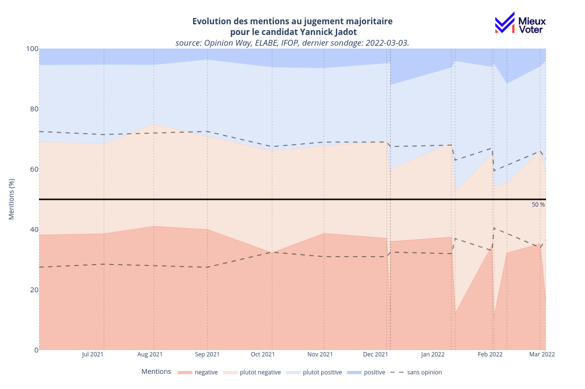

#### Moyenne glissante

La moyenne glissante est une méthode de calcul qui permet de lisser les données sur une fenêtre de temps,
elle permet de réduire le bruit des données et les éventuels biais de chacun des sondages.
Elle a été utilisées sur chaque mentions des sondages agrégés de la même manière qu'elle est classiquement utilisée pour
les intentions de votes pour les sondages au scrutin majoritaire uninominal.
Cependant, en raison du faible nombre de sondages, une moyenne sur 14 jours a été appliquée avec les points disponibles
sur cette fenêtre glissante.

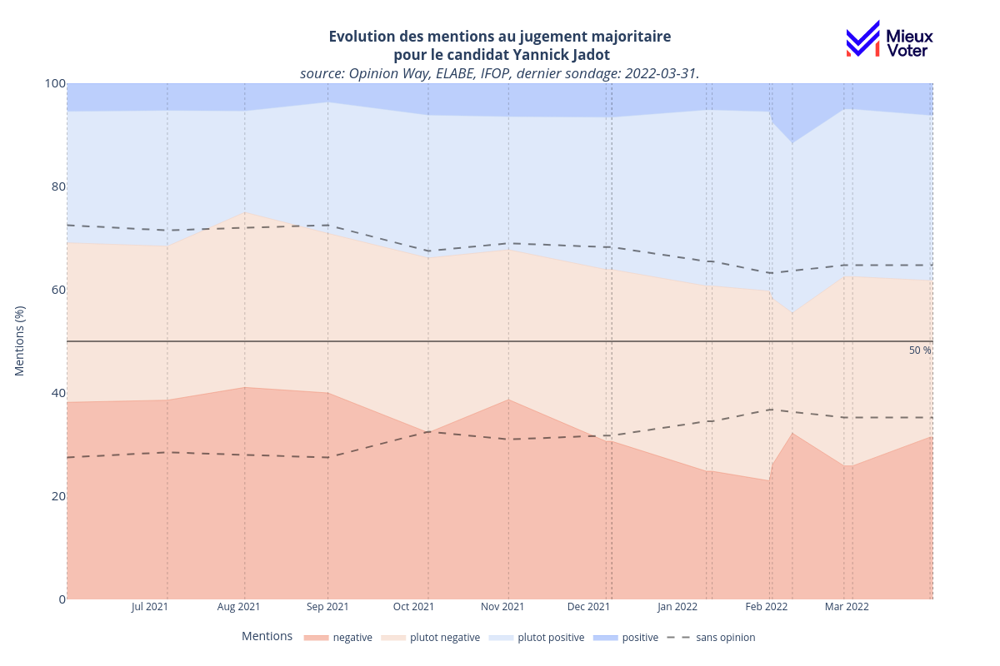

On observe que les mentions sont lissés au cours du temps et permettent de mesurer l'évolution de l'opinion
grâce à l'ensemble des sondages compatibles avec le jugement majoritaire. Ci-dessous, on présente les profils de mérite temporels
pour les candidats avec assez de données au jugement majoritaire.

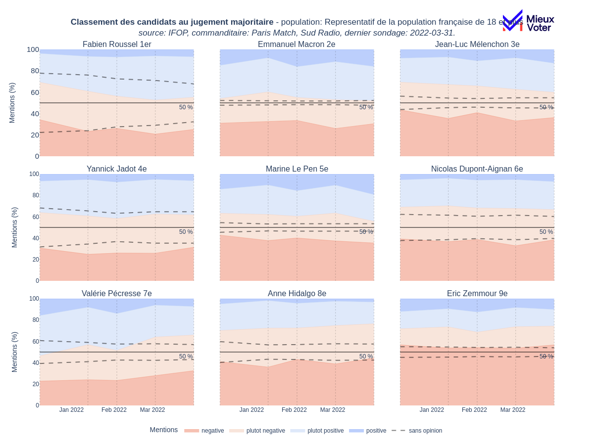

### Conclusion Génerale

Pour la première fois, les sondages et leur aggrégation ont permis de suivre l'évolution de l'opinion sur les candidats à l'élection
présidentielle de 2022. Mieux voter milite pour que les electeurs puisse mieux s'exprimer lors d'une election; nous montrons aussi
qu'il est plus aisé de suivre l'évolution de l'opinion grâce au jugement majoritaire.
Nous espérons que plus de sondage soient commandités au jugement majoritaire ou deviennent compatibles avec le jugement majoritaire.

